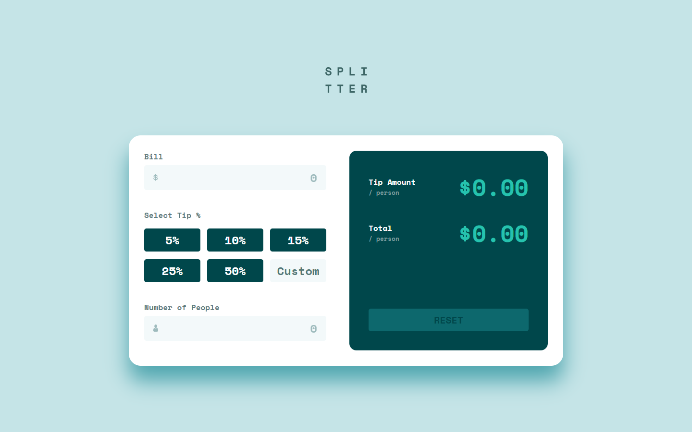
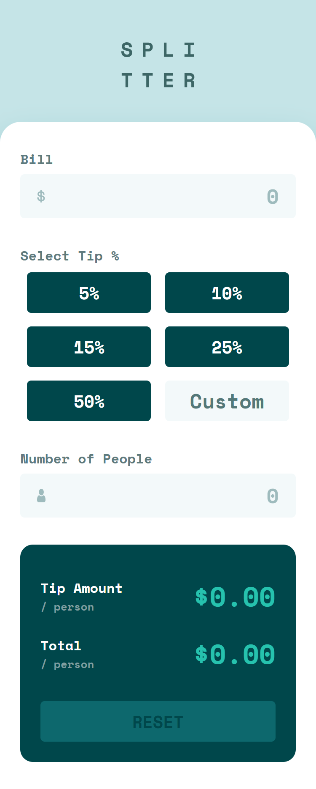

# Tip calculator app

Your challenge is to build this interactive card details form and make it look as close as possible to the design.

## Summary

- [Overview](#overview)
  - [Challenge](#challenge)
  - [Screenshot](#screenshot)
  - [Links](#links)
- [My Process](#my-process)
  - [Built With](#built-with)
  - [What I Learned](#what-i-learned)
  - [Continued Development](#continued-development)
  - [Useful Resources](#useful-resources)
- [Author](#author)
- [Acknowledgments](#acknowledgments)

## Overview

### Challenge

Your challenge is to build out this tip calculator app and get it looking as close to the design as possible.

You can use any tools you like to help you complete the challenge. So if you've got something you'd like to practice, feel free to give it a go.

Your users should be able to:

- Calculate the correct tip and total cost of the bill per person
- View the optimal layout for the app depending on their device's screen size
- See hover states for all interactive elements on the page

### Screenshot




### Links

- [Source code](https://github.com/Otaviano-Manoel/interactive_card_details_form)
- [Live website](https://otaviano-manoel.github.io/interactive_card_details_form/)

## My Process

### Built With


### What I Learned

Using React hooks: I learned how to use several React hooks, such as createContext and useContext. These hooks allowed me to manage state and side effects more efficiently.

Data persistence with localStorage: I used localStorage to save the state of the information. This way, the information is preserved even after updating the page.

```tsx
//Example of useContext.
// Creating a context
import React, { createContext, useContext, useState } from 'react';

// Context creation
const MeuContexto = createContext();

// Context provider component
const MeuProvedor = ({ children }) => {
  const [valor, setValor] = useState('Hello, Context!');

  return (
    <MeuContexto.Provider value={{ valor, setValor }}>
      {children}
    </MeuContexto.Provider>
  );
};

// Context consumer component
const MeuComponente = () => {
  const { valor, setValor } = useContext(MeuContexto);

  return (
    <div>
      <p>{valor}</p>
      <button onClick={() => setValor('Contexto atualizado!')}>
        Atualizar Contexto
      </button>
    </div>
  );
};

// Using the provider in the application
const App = () => (
  <MeuProvedor>
    <MeuComponente />
  </MeuProvedor>
);

export default App;
```

```tsx
// Example of using localStorage
import React, { useState, useEffect } from 'react';

const App = () => {
  const [nome, setNome] = useState('');

  // Load localStorage name when loading component
  useEffect(() => {
    const nomeSalvo = localStorage.getItem('nome');
    if (nomeSalvo) {
      setNome(nomeSalvo);
    }
  }, []);

  // Save the name to localStorage when updated
  useEffect(() => {
    localStorage.setItem('nome', nome);
  }, [nome]);

  return (
    <div>
      <input
        type="text"
        value={nome}
        onChange={(e) => setNome(e.target.value)}
        placeholder="Digite seu nome"
      />
      <p>Nome salvo: {nome}</p>
    </div>
  );
};

export default App;
```

### Continued Development

There are several parts of the project that I would like to improve in the future to make it even more robust and efficient.

- The organization of the code: Despite paying a lot of attention to organization, I had to restart the project once due to initial disorganization. I will continue to refine the code structure and seek best practices to keep everything well organized from the start.

### Useful Resources

- [MDN Web Docs](https://developer.mozilla.org/) - A complete and reliable reference for HTML, CSS, and JavaScript functions and properties. I used it extensively to better understand certain functionalities and best practices.

- [W3Schools](https://www.w3schools.com/) - A valuable resource for learning and referencing HTML, CSS, and React functions. Their explanations and examples helped to quickly clarify doubts.

- [React Documentation](https://reactjs.org/docs/getting-started.html) - The official React documentation was essential for understanding how to use hooks, routing, and other React features correctly and efficiently.

- [ChatGPT](https://www.openai.com/chatgpt) - I used ChatGPT to solve some complex logic and problems I encountered during development. It was helpful for obtaining solutions and code formatting suggestions.

## Author

[Frontend Mentor - @Otaviano-Manoel](https://www.frontendmentor.io/profile/Otaviano-Manoel)

## Acknowledgments

I thank everyone who took the time to view my project. I am in the learning phase and continue to seek to improve my skills to achieve clearer and more functional code. Your feedback is very valuable to me and will be fundamental to my growth as a developer.
